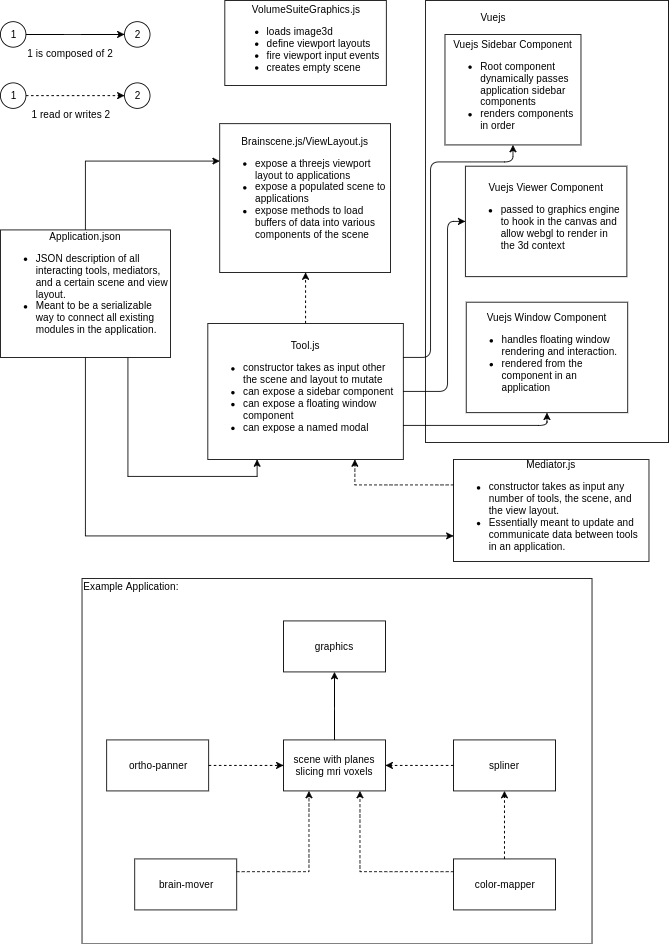

# cervoscope

> An extensible volumetric visualization tool.

This visualization suite is a very generic plugin based browser software
for running arbirary JSON descriptions of applications.

An application is defined first by its name, then by a scene and layout type.
Then we have a ordered list of tools with their corresponding window and sidebar components.
The sidebar components follow the list's order from top to bottom. A tool is described
by a name and a constructor. The name is used to associate a tool to an identifier
when passing the tool intances to mediators.

Each tool is given a reference only to the scene of the application and the layout.
A scene is the underlying model of any application directly being visualized by the layout.
A layout is some perspectives into the scene being rendered on the scene.
A tool can then use the layout and scene to handle some visualization concern.

The application finally has mediators which allow the interaction of tools to occur.
A mediator is described by a list of dependencies which are passed as constructor arguments
to the mediator upon application initialization. The tool names are used to reference a
particular tool instance. This allows multiple tools of the same constructor to be
instantiated and referenced by name.

A mediator, tool and scene may have an update function which is called each render
frame. This is helpful for immediate updates that need to occur to the scene over time.
One should typically not use the render loop to update with respect to a variable unless
the application is simplified and the computation is fast. The preffered approach is
to use callbacks but this can get unwiedly when an interaction depends on a very large
number of state variables.

The idea of this suite is to write simple tools and mediator is such a way
that allows applications to be described using only JSON descriptions. This should
make visualization development a more streamlined task rather than building arbitrary
visualization tool which need similar layouts, scenes, and operations.

The architecture is modelled accordingly



## Build Setup

``` bash
# install dependencies
npm install

# serve with hot reload at localhost:8080
npm run dev

# build for production with minification
npm run build

# build for production and view the bundle analyzer report
npm run build --report

# run unit tests
npm run unit

# run e2e tests
npm run e2e

# run all tests
npm test
```

For detailed explanation on how things work, checkout the [guide](http://vuejs-templates.github.io/webpack/) and [docs for vue-loader](http://vuejs.github.io/vue-loader).
